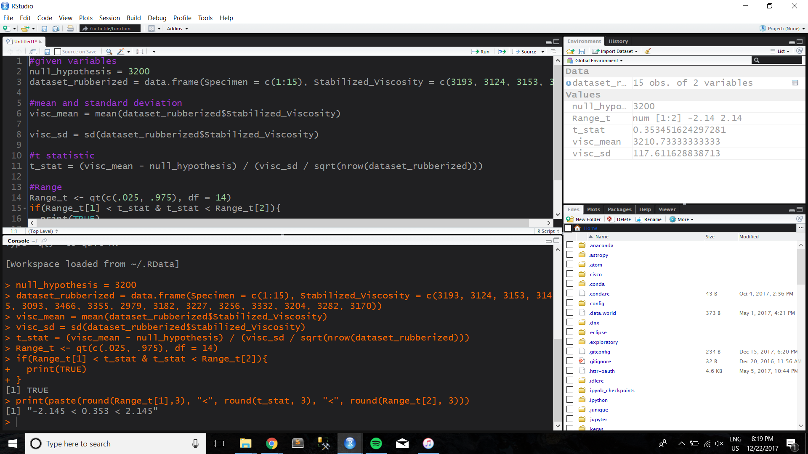
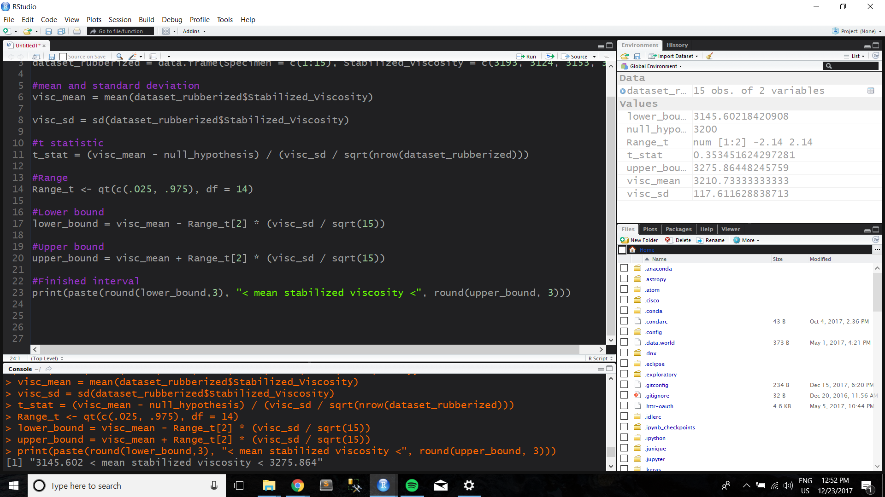
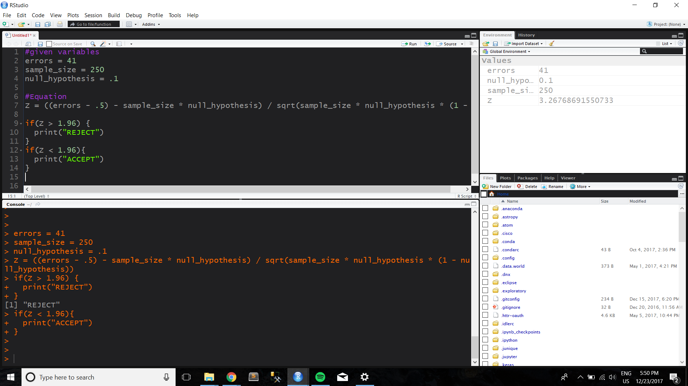
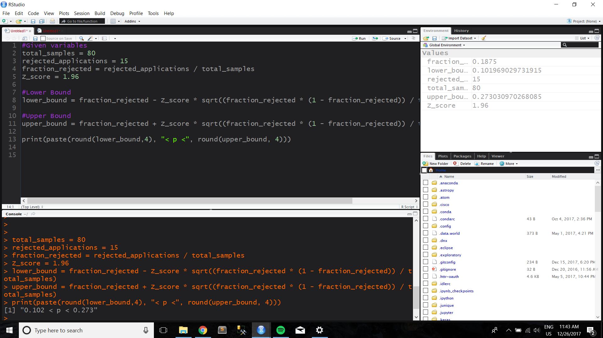
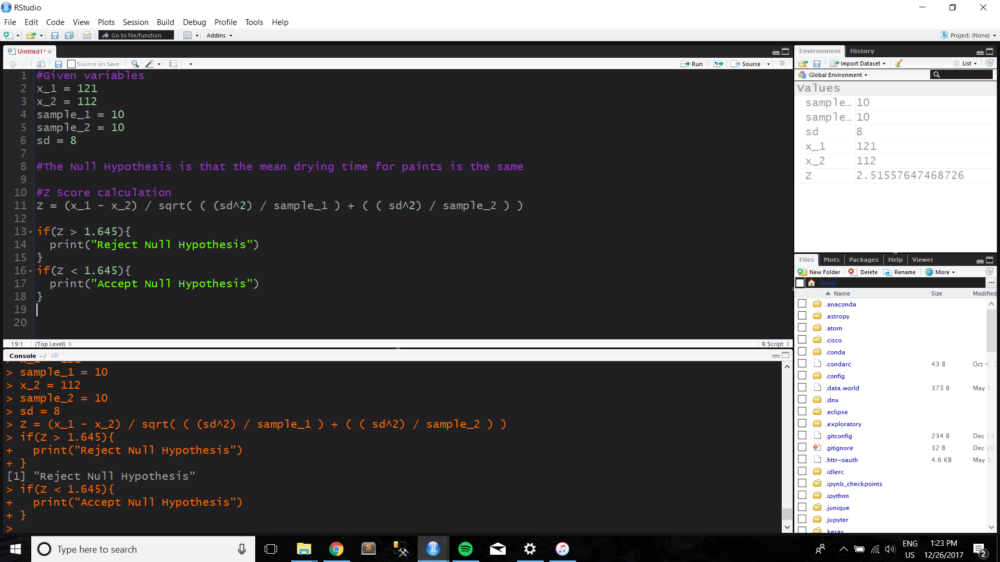
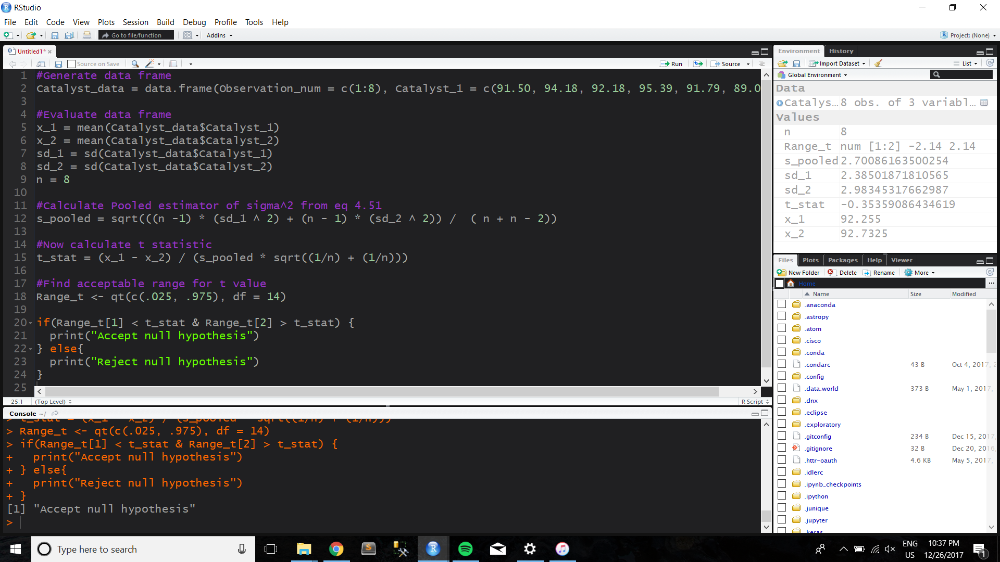
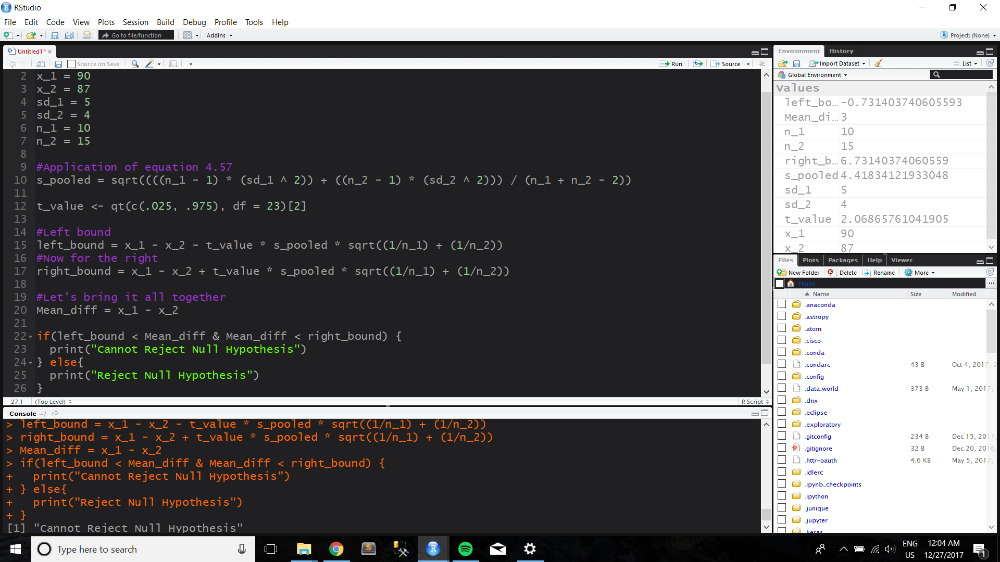
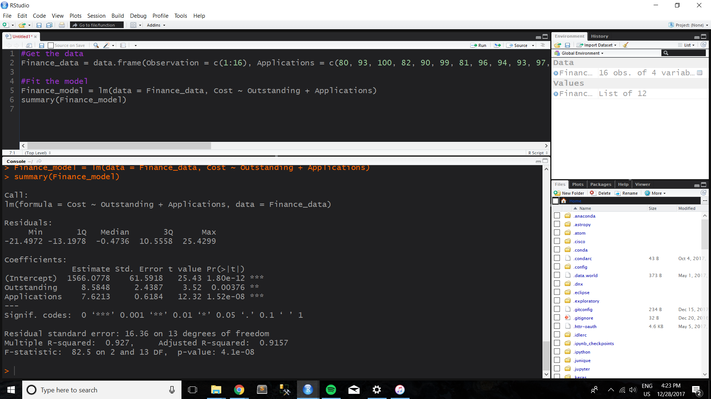

```{r include=FALSE}
library(knitr)
```


This walkthrough will go over each of the example exercises in chapter 4, covering Inferences about Process Quality.


## Example 4.1: Computer Response Time

This example teaches us about basic hypothesis testing and One-Sample Z tests specific to the question "is the mean response time to a specific type of command greater than 75 ms". We're given the mean of a random sample (called x_bar), the hypothesis mean (called mu), the standard deviation (called sd), and the size of the sample (called n). 

Here's how to do it in R.


```{r}
#first define the variables
x_bar = 79.25
sample_mu = 75
sd = 8
n = 25

#now find the Z score

Z = (x_bar - sample_mu) / (sd / sqrt(n))
p = 1 - pnorm(Z)

print(paste("The Z score of the example is ", Z, ", and the p score associated is ", p, sep = ""))


```

Because we specified a type 1 error of a = .05 and the test is one sided, we reject the null hypothesis and conclude that the mean response time exceeds 75ms. 

```{r}

#After running the code above, your screen should look like the output below

include_graphics("Screenshots/Example_4_1.png")


```


## Example 4.2: Computer Response Time pt 2


This example introduces two-sided confidence intervals to what we already know about hypothesis testing using a similar example to 4.1. The following R code explains how to compute this given x_bar, Z, sigma, and n.


```{r}
#first define variables
x_bar = 79.25
Z = 1.96
sigma = 8
n = 25

#Lower bound
lower_bound = x_bar - (Z) * (sigma / sqrt(n))

#Upper bound
upper_bound = x_bar + (Z) * (sigma / sqrt(n))

#Result
print(paste(lower_bound, "< mu <", upper_bound))

```

```{r}
#After running the code above, your screen should look like the output below

include_graphics("Screenshots/Example_4_2.png")
```

## Example 4.3: Rubberized Asphalt


This example asks us to interpret a dataset to find the sample standard deviation and sample mean, and use the test statistic for a fixed significance level. Now for the R!

```{r}
#given variables
null_hypothesis = 3200
dataset_rubberized = data.frame(Specimen = c(1:15), Stabilized_Viscosity = c(3193, 3124, 3153, 3145, 3093, 3466, 3355, 2979, 3182, 3227, 3256, 3332, 3204, 3282, 3170))

#mean and standard deviation
visc_mean = mean(dataset_rubberized$Stabilized_Viscosity)

visc_sd = sd(dataset_rubberized$Stabilized_Viscosity)

#t statistic
t_stat = (visc_mean - null_hypothesis) / (visc_sd / sqrt(nrow(dataset_rubberized)))

#Range
Range_t <- qt(c(.025, .975), df = 14)
if(Range_t[1] < t_stat & t_stat < Range_t[2]){
  print(TRUE)
}
print(paste(round(Range_t[1],3), "<", round(t_stat, 3), "<", round(Range_t[2], 3)))


```

After completion, your screen should look something like this

```{r}


```


## Example 4.4: Rubberized Viscosity pt 2

Working off of the previous example, 4.4 asks us to find the 95% confidence interval on the mean stabilized viscosity given equation 4.36. The implementation in R is as follows.

```{r}
#given variables
null_hypothesis = 3200
dataset_rubberized = data.frame(Specimen = c(1:15), Stabilized_Viscosity = c(3193, 3124, 3153, 3145, 3093, 3466, 3355, 2979, 3182, 3227, 3256, 3332, 3204, 3282, 3170))

#mean and standard deviation
visc_mean = mean(dataset_rubberized$Stabilized_Viscosity)

visc_sd = sd(dataset_rubberized$Stabilized_Viscosity)

#t statistic
t_stat = (visc_mean - null_hypothesis) / (visc_sd / sqrt(nrow(dataset_rubberized)))

#Range
Range_t <- qt(c(.025, .975), df = 14)

#Lower bound
lower_bound = visc_mean - Range_t[2] * (visc_sd / sqrt(15))

#Upper bound
upper_bound = visc_mean + Range_t[2] * (visc_sd / sqrt(15))

#Finished interval
print(paste(round(lower_bound,3), "< mean stabilized viscosity <", round(upper_bound, 3)))


```

```{r}

```


## Example 4.5: A Forging Process

This example is similar to example 4.4, but the hypothesis is a p value instead of a mean, using the inference on a population proportion's formula (equation 4.43)  Here we go!

```{r}
#given variables
errors = 41
sample_size = 250
null_hypothesis = .1

#Equation
Z = ((errors - .5) - sample_size * null_hypothesis) / sqrt(sample_size * null_hypothesis * (1 - null_hypothesis))

if(Z > 1.96) {
  print("REJECT")
}
if(Z < 1.96){
  print("ACCEPT")
}

```

```{r}

```

## Example 4.6: Mortgage Applications

Given a fraction of acceptable samples and a desired percent confidence, can we find a confidence interval? Here's how using equation 4.44

```{r}
#Given variables
total_samples = 80
rejected_applications = 15
fraction_rejected = rejected_applications / total_samples
Z_score = 1.96

#Lower Bound
lower_bound = fraction_rejected - Z_score * sqrt((fraction_rejected * (1 - fraction_rejected)) / total_samples)

#Upper Bound
upper_bound = fraction_rejected + Z_score * sqrt((fraction_rejected * (1 - fraction_rejected)) / total_samples)

print(paste(round(lower_bound,4), "< p <", round(upper_bound, 4)))


```

```{r}


```

## Example 4.7: Finding the Power of a Test

```{r}
#install.packages("asbio")


```

```{r}
#currently can't figure this out, it is throwing me a bunch of errors and the wrong answer, will revisit later
#library(asbio)

#power = power.z.test(sigma = .1, effect = 1, n = 9, test = "one.tail")

#print(power)

```


## Example 4.8: Comparing Paint Formulations

This example focuses on two samples and creating/testing  hypotheses specific to them. We're given the means of both samples, and need to test whether or not there is a significant difference from the two. Here is the implementation of equation 4.48 in R:


```{r}
#Given variables
x_1 = 121
x_2 = 112
sample_1 = 10
sample_2 = 10
sd = 8

#The Null Hypothesis is that the mean drying time for paints is the same

#Z Score calculation
Z = (x_1 - x_2) / sqrt( ( (sd^2) / sample_1 ) + ( ( sd^2) / sample_2 ) )

if(Z > 1.645){
  print("Reject Null Hypothesis")
}
if(Z < 1.645){
  print("Accept Null Hypothesis")
}

```


```{r}

```

## Example 4.9 Comparing Mean Yields

Given a dataset of two populations and 8 observations each, let's use a t test to figure out which catalyst should be adopted. The example specifies that catalyst 2 is cheaper and should be used if there is no difference between the two. 

```{r}

#Generate data frame
Catalyst_data = data.frame(Observation_num = c(1:8), Catalyst_1 = c(91.50, 94.18, 92.18, 95.39, 91.79, 89.07, 94.72, 89.21), Catalyst_2 = c(89.19, 90.95, 90.46, 93.21, 97.19, 97.04, 91.07, 92.75))

#Evaluate data frame
x_1 = mean(Catalyst_data$Catalyst_1)
x_2 = mean(Catalyst_data$Catalyst_2)
sd_1 = sd(Catalyst_data$Catalyst_1)
sd_2 = sd(Catalyst_data$Catalyst_2)
n = 8

#Calculate Pooled estimator of sigma^2 from eq 4.51
s_pooled = sqrt(((n -1) * (sd_1 ^ 2) + (n - 1) * (sd_2 ^ 2)) /  ( n + n - 2))

#Now calculate t statistic
t_stat = (x_1 - x_2) / (s_pooled * sqrt((1/n) + (1/n)))

#Find acceptable range for t value
Range_t <- qt(c(.025, .975), df = 14)

if(Range_t[1] < t_stat & Range_t[2] > t_stat) {
  print("Accept null hypothesis")
} else{
  print("Reject null hypothesis")
}


```

```{r}
#Here's what an R console would look like

```


## Example 4.10: Doped Versus Undoped Cement

The crux of this example is the two samples t test with two different sample sizes. Given the means, standard deviation, and sample size of both samples, we need to use the t test to determine if there is an affect, in this case, of doping cement. 

```{r}
#Given variables
x_1 = 90
x_2 = 87
sd_1 = 5
sd_2 = 4
n_1 = 10
n_2 = 15

#Application of equation 4.57
s_pooled = sqrt((((n_1 - 1) * (sd_1 ^ 2)) + ((n_2 - 1) * (sd_2 ^ 2))) / (n_1 + n_2 - 2))

t_value <- qt(c(.025, .975), df = 23)[2]

#Left bound
left_bound = x_1 - x_2 - t_value * s_pooled * sqrt((1/n_1) + (1/n_2))
#Now for the right
right_bound = x_1 - x_2 + t_value * s_pooled * sqrt((1/n_1) + (1/n_2))

#Let's bring it all together
Mean_diff = x_1 - x_2

if(left_bound < Mean_diff & Mean_diff < right_bound) {
  print("Cannot Reject Null Hypothesis")
} else{
  print("Reject Null Hypothesis")
}


```

```{r}
#Here's what an R console would look like

```

## Example 4.11: The Paired t-Test

We are given two different types of machines that are used to measure the tensile strength of synthetic fiber, and we're attempting to determine the significance of the difference in yield. We do this using a paired t-Test, here is the implementation

```{r}
#set up the dataframe
Paired_tensile = data.frame(Specimen = c(1:8), Machine_1 = c(74,76,74,69,58,71,66,65), Machine_2 = c(78, 79, 75, 66, 63, 70, 66, 67), Difference = c(-4,-3,-1,3,-5,1,0,-2))

#Find necessary variables
diff_mean = mean(Paired_tensile$Difference)

sum_sq = sum(Paired_tensile$Difference^2)
squared_sum = sum(Paired_tensile$Difference) ^ 2
n = nrow(Paired_tensile)
s_pooled = sqrt((sum_sq - (squared_sum / n)) / (n-1))

t_statistic = diff_mean / (s_pooled / sqrt(n))
if(qt(c(.025, .975), df = 7)[2] > abs(t_statistic)){
  print("Do not reject Null Hypothesis")
} else{
  print("Reject Null Hypothesis")
}

```

```{r}


```

## Example 4.12: The Paper Tensile Strength Experiment

In this example, we'll use analysis of variance to test the null hypothesis that different hardwood concentrations do not affect the mean tensile strength of the paper.

```{r}
#Load dataset
Tensile_observations = data.frame(Hardwood_concentration = c(5,10,15,20), One = c(7,12,14,19), Two = c(8,17,18,25), Three = c(15,13,19,22), Four = c(11,18,17,23), Five = c(9,19,16,18), Six = c(10,15,18,20))

Tensile_observations$Totals = rowSums(Tensile_observations[,c("One", "Two", "Three", "Four", "Five", "Six")])
Tensile_observations$Averages = Tensile_observations$Totals / 6

Sum_Squares_Total = sum(sum(Tensile_observations$One ^ 2), sum(Tensile_observations$Two ^ 2), sum(Tensile_observations$Three ^ 2), sum(Tensile_observations$Four ^ 2),sum(Tensile_observations$Five ^ 2), sum(Tensile_observations$Six ^ 2)) - (sum(Tensile_observations$Totals) ^ 2) / 24

Sum_Squares_Treatment = (sum(Tensile_observations$Totals ^ 2) / 6) - (sum(Tensile_observations$Totals) ^ 2) / 24

Sum_Squares_E = Sum_Squares_Total - Sum_Squares_Treatment

Tensile_observations$Hardwood_concentration = as.factor(Tensile_observations$Hardwood_concentration)
a = 4
n = 6
error_mean_square = Sum_Squares_E / (a * (n-1))

F_stat = (Sum_Squares_Treatment / (a-1) ) / (Sum_Squares_E / (a * ( n -1)))

if(F_stat > qf(c(.01, .99), 3, 20)[2]){
  print("Reject Null Hypothesis")
}

```

After completion, the R console should look something like this

```{r}
include_graphics("Screenshots/Example_4_12.png")

```

## Example 4.13: Fitting a Linear Regression Model

The focus of this example is using the number of new applications and number of outstanding loans to predict the operating cost of a branch office. Here's model fitting in R

```{r}
#Get the data
Finance_data = data.frame(Observation = c(1:16), Applications = c(80, 93, 100, 82, 90, 99, 81, 96, 94, 93, 97, 95, 100, 85, 86, 87), Outstanding = c(8,9,10,12,11,8,8,10,12,11,13,11,8,12,9,12), Cost = c(2256,2340,2426,2293,2330,2368,2250,2409,2364,2379,2440,2364,2404,2317,2309,2328))

#Fit the model
Finance_model = lm(data = Finance_data, Cost ~ Outstanding + Applications)
summary(Finance_model)

```

Here's the output of the summary

```{r}

```

## Example 4.14: The Extra Sum of Squares Method

Can't really figure this one out, will work on later


## Example 4.15: A Confidence Interval on a Regression Coefficient

We're asked to make a 95% confidence interval for the parameter B1. Turns out, there is a very useful function in R for this exact thing.

```{r}
Finance_data = data.frame(Observation = c(1:16), Applications = c(80, 93, 100, 82, 90, 99, 81, 96, 94, 93, 97, 95, 100, 85, 86, 87), Outstanding = c(8,9,10,12,11,8,8,10,12,11,13,11,8,12,9,12), Cost = c(2256,2340,2426,2293,2330,2368,2250,2409,2364,2379,2440,2364,2404,2317,2309,2328))

Finance_model = lm(data = Finance_data, Cost ~ Outstanding + Applications)

confint(Finance_model, "Applications")


```

After completion, the R studio console should look something like this

```{r}


```


