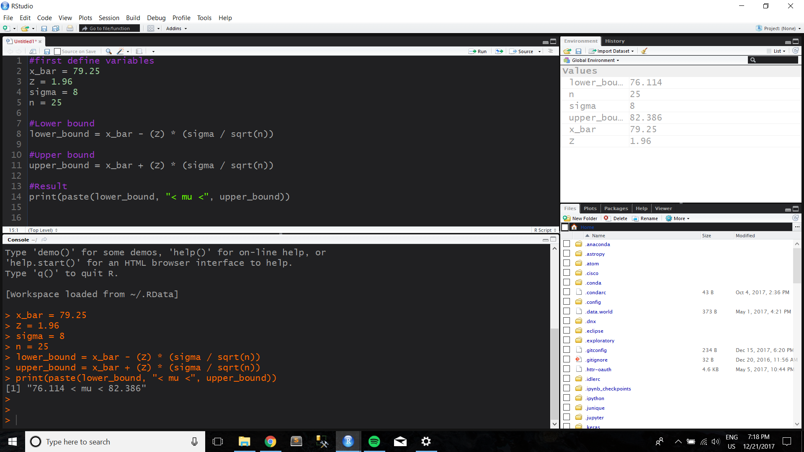

```{r include=FALSE}
library(knitr)
```

  
  
## Example 4.1: Computer Response Time


The response time of a distributed computer system is an important quality characteristic. The system manager wants to know whether the mean response time to a specific type of command exceeds 75 millisec. From previous experience, he
knows that the standard deviation of response time is 8 millisec. 
  
Here's how to do it in R.


```{r}
#first define the variables
x_bar = 79.25
sample_mu = 75
sd = 8
n = 25

#now find the Z score

Z = (x_bar - sample_mu) / (sd / sqrt(n))
p = 1 - pnorm(Z)

print(paste("The Z score of the example is ", round(Z,3), ", and the p score associated is ", round(p,4), sep = ""))


```

Because we specified a type 1 error of a = .05 and the test is one sided, we reject the null hypothesis as 2.656 > 1.645 and conclude that the mean response time exceeds 75ms. 

```{r}

#After running the code above, your screen should look like the output below

include_graphics("Screenshots/Example_4_1.png")


```


## Example 4.2: Computer Response Time pt 2


Reconsider the computer response time scenario from Example 4.1. Since millisec, we know that a reasonable point estimate of the mean response time is 79.25 millisec. Find a 95% two-sided confidence interval.


```{r}
#first define variables
x_bar = 79.25
Z = 1.96
sigma = 8
n = 25

#Lower bound
lower_bound = x_bar - (Z) * (sigma / sqrt(n))

#Upper bound
upper_bound = x_bar + (Z) * (sigma / sqrt(n))

#Result
print(paste(lower_bound, "< mu <", upper_bound))

```

```{r}
#After running the code above, your screen should look like the output below


```

## Example 4.3: Rubberized Asphalt

Rubber can be added to asphalt to reduce road noise when the material is used as pavement. Table 4.1 shows the stabilized viscosity (cP) of 15 specimens of asphalt paving material. To be suitable for the intended pavement application, the mean stabilized viscosity should be equal to 3200. Test this hypothesis using Based on experience we are willing to initially assume that stabilized viscosity is normally distributed.


```{r}
#given variables
null_hypothesis = 3200
dataset_rubberized = data.frame(Specimen = c(1:15), Stabilized_Viscosity = c(3193, 3124, 3153, 3145, 3093, 3466, 3355, 2979, 3182, 3227, 3256, 3332, 3204, 3282, 3170))

#mean and standard deviation
visc_mean = mean(dataset_rubberized$Stabilized_Viscosity)

visc_sd = sd(dataset_rubberized$Stabilized_Viscosity)

#t statistic
t_stat = (visc_mean - null_hypothesis) / (visc_sd / sqrt(nrow(dataset_rubberized)))

#We want to use both the .025 and the .975 values, and so we can pass both of those into our qt() file which covers the t distribution
#then we can get the first and second values for the t distribution by Range_t[1] and Range_t[2] respectively

Range_t <- qt(c(.025, .975), df = 14)
if(Range_t[1] < t_stat & t_stat < Range_t[2]){
  print(TRUE)
}
print(paste(round(Range_t[1],3), "<", round(t_stat, 3), "<", round(Range_t[2], 3)))


```

The example also asks us to create a normal probability plot of the data. We covered this in chapter 3. 

```{r}
library(e1071)
probplot(dataset_rubberized$Stabilized_Viscosity)

```


## Example 4.3.4: Inference on the Variance of a Normal Distribution
  
Demonstrate the computation of a 95% confidence interval on sigma^2 using the viscosity data from Example 4.3. 
  
  
```{r}
#given variables
s = 117.61 #from data in Table 4.1
s_sqrd = s * s
degree_freedom = 14


#we'll use equation 4.39 to calculate the upper and lower bounds 

#lower bound
lower_bound = degree_freedom*s_sqrd / qchisq(.975,degree_freedom)

#upper bound
upper_bound = degree_freedom*s_sqrd / qchisq(.025,degree_freedom)

paste("The interval is from ", round(sqrt(lower_bound),3), " to ", round(sqrt(upper_bound),3))

```

  
   
  
## Example 4.4: Rubberized Viscosity pt 2

Reconsider the stabilized viscosity data from Example 4.3. Find a 95% confidence interval on the mean stabilized viscosity.

```{r}
#given variables
null_hypothesis = 3200
dataset_rubberized = data.frame(Specimen = c(1:15), Stabilized_Viscosity = c(3193, 3124, 3153, 3145, 3093, 3466, 3355, 2979, 3182, 3227, 3256, 3332, 3204, 3282, 3170))

#mean and standard deviation
visc_mean = mean(dataset_rubberized$Stabilized_Viscosity)

visc_sd = sd(dataset_rubberized$Stabilized_Viscosity)

#t statistic
t_stat = (visc_mean - null_hypothesis) / (visc_sd / sqrt(nrow(dataset_rubberized)))

#Range
Range_t <- qt(c(.025, .975), df = 14)

#Lower bound
lower_bound = visc_mean - Range_t[2] * (visc_sd / sqrt(15)) #the brackets index the Range_t vector, giving us the second value

#Upper bound
upper_bound = visc_mean + Range_t[2] * (visc_sd / sqrt(15))

#Finished interval
print(paste(round(lower_bound,3), "< mean stabilized viscosity <", round(upper_bound, 3)))


```

## Example 4.5: A Forging Process

A foundry produces steel forgings used in automobile manufacturing.
We wish to test the hypothesis that the fraction conforming or fallout from this process is 10%. In a random sample of 250 forgings, 41 were found to be nonconforming. 
  
What are your conclusions using a = 0.05?


```{r}
#given variables
errors = 41
sample_size = 250
null_hypothesis = .1

#Equation
Z = ((errors - .5) - sample_size * null_hypothesis) / sqrt(sample_size * null_hypothesis * (1 - null_hypothesis))

#an if statement only runs if the statement inside the parentheses
#for example
if(2>1){
  print("Go Gators")
}
#prints Go Gators

#Let's use if statements to decide whether or not to accept the hypothesis
if(Z > 1.96) {
  print("REJECT")
}
if(Z < 1.96){
  print("ACCEPT")
}

```
  
  
## Example 4.6: Mortgage Applications

In a random sample of 80 home mortgage applications processed by an automated decision system, 15 of the applications were not approved. The point estimate of the fraction that was not approved is 15/80 = .1875.  
Assuming that the normal approximation to the binomial is appropriate, find a 95% confidence interval on the fraction of nonconforming mortgage applications in the process.
  
  
```{r}
#Given variables
total_samples = 80
rejected_applications = 15
fraction_rejected = rejected_applications / total_samples
Z_score = 1.96 #z is 1.96 for a 95% confidence interval

#Lower Bound
lower_bound = fraction_rejected - Z_score * sqrt((fraction_rejected * (1 - fraction_rejected)) / total_samples)

#Upper Bound
upper_bound = fraction_rejected + Z_score * sqrt((fraction_rejected * (1 - fraction_rejected)) / total_samples)

print(paste(round(lower_bound,4), "< p <", round(upper_bound, 4)))


```

## Example 4.7: Finding the Power of a Test
  
```{r}
#Given Variables
h0 = 16.1
h1 = 16.0
mean_difference = h0 - h1
standard_dev = .1
n = 9
z_desired = 1.96

#Find the beta, using equation 4.46
beta = pnorm((z_desired - (mean_difference * sqrt(n))/standard_dev)) - pnorm(-z_desired - (mean_difference * sqrt(n)/standard_dev))

power = 1 - beta
power

```
